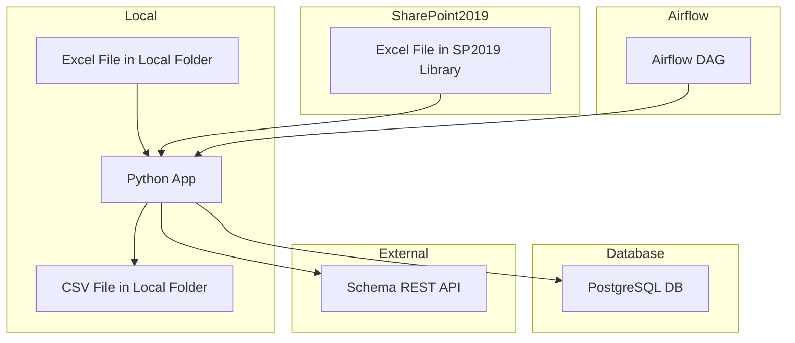

# System Patterns: Excel Data Importer

## System Architecture
The system is developed in four incremental phases:

- **Phase 1: Local File Processing**: The application reads Excel files from a local folder, validates and transforms the data, and exports the results to a CSV file in a local folder. This phase is designed for rapid, offline development and testing.

- **Phase 2: Database Export**: The application replaces CSV export with direct export to a PostgreSQL database, introducing transactional data handling and persistence.

- **Phase 3: SharePoint Server 2019 Integration**: The application imports Excel files from a SharePoint Server 2019 document library (not Office 365/SharePoint Online), continuing to export data to the database.

- **Phase 4: Workflow Orchestration and Schema API**: The application is orchestrated by Airflow and uses a REST API for schema validation, enabling enterprise-scale automation and dynamic validation rules.

## Key Technical Decisions
- **Incremental Development**: The phased approach allows for early validation of core logic and incremental introduction of complexity.
- **Local-First**: Starting with local file/folder operations ensures the core logic is robust and testable before introducing external dependencies.
- **Database as Source of Truth**: In phase 2 and beyond, the database becomes the primary destination for processed data.
- **SharePoint Server 2019**: Integration is specifically with SharePoint Server 2019, not Office 365/SharePoint Online, to match enterprise requirements.
- **Workflow Orchestration**: Airflow is introduced only after the core logic and integrations are proven.

## Design Patterns in Use
- **ETL (Extract, Transform, Load)**: The core pattern for all phases.
- **Mocking for Offline Development**: Test data generators and local files are used to simulate external inputs, enabling rapid, offline testing.
- **Separated Test Runner**: The application includes a dedicated test runner script (`run_tests.py`) that is completely independent of the production entry point (`main.py`).

## Component Relationships

## Critical Implementation Paths
- **File I/O**: Reading and writing files locally must be robust and handle edge cases (e.g., missing files, permissions).
- **Data Validation Engine**: The accuracy of the data validation logic is paramount.
- **Database Transactions**: In phase 2 and beyond, all database operations must be transactional.
- **SharePoint Server 2019 API**: Integration must use the correct API for on-premises SharePoint.
- **Workflow Orchestration**: Airflow integration must be modular and not disrupt the core logic.
- **Structured JSON Logging**: All process events (row import, validation, export, error, etc.) are logged in JSON format compatible with ElasticSearch, including: `timestamp`, `file_name`, `id_type`, `id_value`, `product`, `level`, `action`, `result`. In Phase 1, logging occurs after CSV export; in Phase 2 (and beyond), logging occurs after successful or failed database export. 