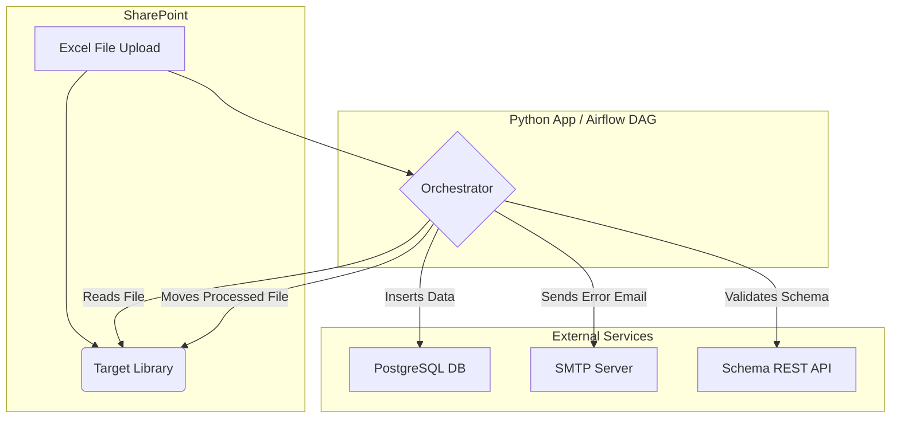

# System Patterns: Excel Data Importer

## System Architecture
The system follows a phased data pipeline architecture that evolves from a standalone script to a managed Airflow DAG.

- **Phase 1 - Standalone Application**: A Python script, orchestrated by a system scheduler (like cron), performs the entire ETL process. It reads a `config.yaml` file for parameters, connects to SharePoint to fetch Excel files, processes them, and loads the data into a PostgreSQL database. The structure is modular, with core logic separated into a `utils.py` file.

- **Phase 2 - Airflow DAG**: The logic from the standalone application is refactored into tasks within an Airflow DAG. Airflow manages scheduling, execution, retries, and monitoring. In this phase, the schema for validating descriptive data is fetched from an external REST API, making the validation process more dynamic.

## Key Technical Decisions
- **Separation of Concerns**: Configuration (`config.yaml`) is strictly separated from the application code, allowing for easy updates without touching the logic.
- **Flexible Data Handling with JSONB**: Using a `jsonb` column (`dane_opisowe`) in PostgreSQL to store variable descriptive data. This avoids rigid table structures and allows the importer to handle new or unexpected columns in the source Excel files gracefully.
- **Immutable Data History**: On finding a duplicate record (based on `id_type`, `id_value`, `product`), the system creates a new version with an updated timestamp and merged descriptive data, rather than overwriting the existing record. This preserves a full audit trail.
- **Phased Development**: A two-phase approach was chosen to de-risk the project. It allows the core business logic to be built and tested first (Phase 1) before introducing the complexities of a distributed workflow orchestrator like Airflow (Phase 2).

## Design Patterns in Use
- **ETL (Extract, Transform, Load)**: This is the overarching pattern.
  - **Extract**: Reading Excel files from the SharePoint library.
  - **Transform**: Applying business rules, validating data against schemas, mapping columns, and handling versioning.
  - **Load**: Inserting the processed records into the PostgreSQL `blacklist.entity` table.
- **Utility/Helper Functions**: The core, reusable logic for interacting with SharePoint, the database, and performing validation is encapsulated in helper functions within `utils.py` to keep the main script clean and readable.
- **Strategy Pattern (Conceptual)**: The validation logic can be seen as a strategy. In Phase 1, the strategy is to use a local schema file. In Phase 2, the strategy is switched to use a REST API, without changing the core import workflow.
- **Mocking for Offline Development**: Test data generators (e.g., `test_utils.py`) are used to simulate external inputs like Excel files. This pattern decouples the core data processing and validation logic from the modules that interact with live external services, enabling rapid, offline testing of the pipeline's business rules.
- **Separated Test Runner**: The application includes a dedicated test runner script (`run_tests.py`) that is completely independent of the production entry point (`main.py`). This allows for safe and repeatable testing of the core logic without invoking any production code that might interact with live services.

## Component Relationships

## Critical Implementation Paths
- **SharePoint Authentication and API Interaction**: The connection and authentication with SharePoint are critical. The logic must be robust to handle API changes or transient network issues.
- **Data Validation Engine**: The accuracy of the data validation logic is paramount. Errors in this component could lead to corrupt data entering the database or valid data being rejected.
- **Record Versioning Logic**: The process of identifying existing records and correctly creating new versions with merged JSONB data must be atomic and free of race conditions to ensure data consistency.
- **Transactional File Moves**: Moving files to the `imported` or `broken` folders in SharePoint must be a transactional step that only occurs after the database operation (or the decision to reject) is finalized. This prevents a file from being processed more than once. 